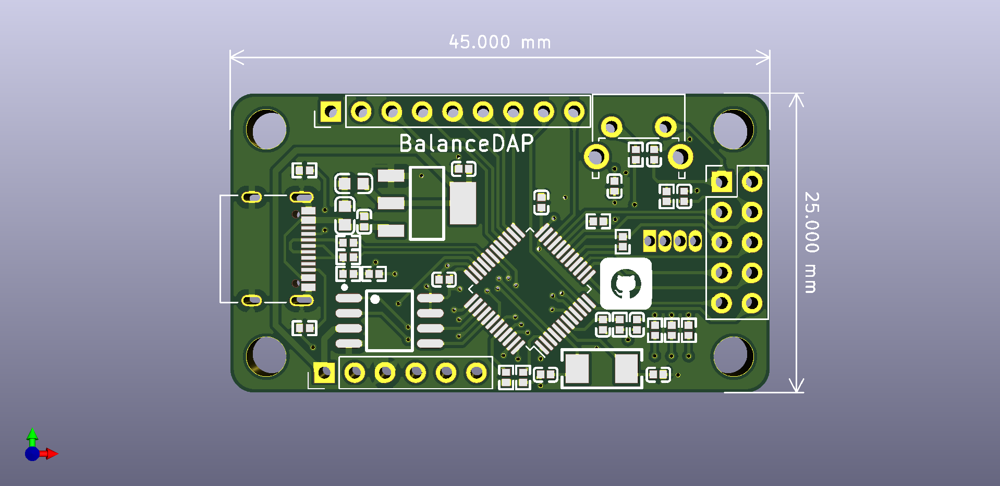
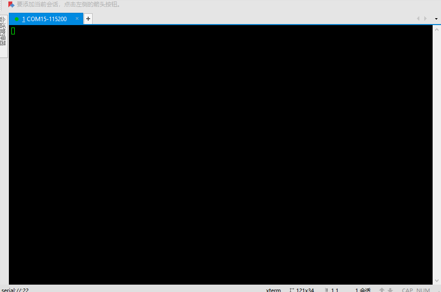
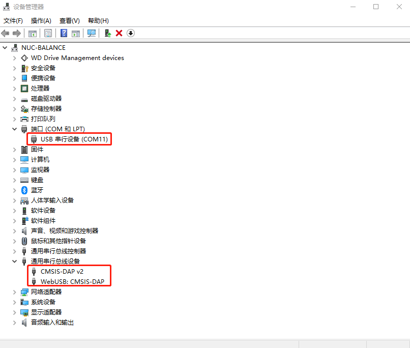

# BalanceDAP

本项目长期偶尔更新！如有疑问，请[邮箱](mailto:balancetwk@yeah.net)联系我。balanceTWK@yeah.net

代码工程：基于开源免费的 [DAPLink](https://github.com/ARMmbed/DAPLink), [RT-Thread](https://github.com/RT-Thread/rt-thread),

电路板工程：使用开源免费的 [KiCad](http://docs.kicad-pcb.org/) 构建。

本仓库同样开源免费，遵守 [Apache License 2.0 协议](./LICENSE).

## 电路板效果图

## 移植成 rt-thread 后的效果：

## 问题汇总：

 1. 关于使用 KiCad 打开工程出现原理图缺失元器件的问题：原因是没有安装和作者相同的 KiCad 库，请到此 [链接](https://github.com/balanceTWK/lc_kicad_lib)  处下载。

 2. 关于 MDK 不识别 CMSIS-DAP V2 的问题：参考 /doc 目录下 [Notes.md](doc/Notes.md)。
